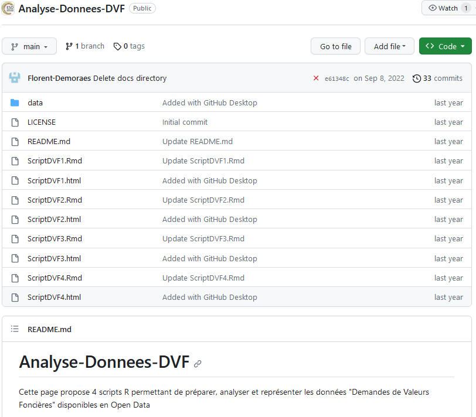

```{r setup, include=FALSE}
knitr::opts_chunk$set(echo = TRUE, message=F, warning=F)
library(knitr)
library(tidyverse)
library(data.table)
library(sf)
library(mapsf)
```


# DVF 2 :  Nettoyage des données

## Introduction

### Objectif
On se propose de nettoyer les donénes relative à l'ensemble des ventes de maison ou d'appartement dans un rayon de 50 km autour d'une ville. On rappelle les paramètres qui ont été utilisés pour acquérir ces données. 

### Paramètres
```{r paramètres, echo=T}
# Commune centre 
codectr<-  "35238"  # Code
namectr <- "Rennes"  # Nom
latctr <-  -1.67789
lonctr <-  48.11204
# Choix du rayon de collecte des dvf (en mètres)
rayon <- 50000
# Dossier de stockage
myrep <- "data/Rennes/"
# Fichier dvf brut
myfic <-"dvf.csv"
```


## Merci à Boris et Florent !

Nous allons effectuer le nettoyage en nous appuyant sur les propositions de Boris Mericskay et Florent Demoraes parues dans  https://journals.openedition.org/cybergeo/39583 

```{r, out.width="80%", echo=F}
include_graphics("figures/boris001.png")
```

## Merci à Boris et Florent !

Les auteurs fournissent en effet un accès à tous les programmes utilisés dans leur article via une archive github :
https://github.com/ESO-Rennes/Analyse-Donnees-DVF


```{r, out.width="60%", echo=F}


```


## Chargement du jeu de données

On adapte le programme de Boris et Florent en utilisant la fonction `fread()` du package **data.table** car elle est plus rapide/

```{r}
DVF<-fread("data/Rennes/dvf.csv")
```


## Etape 1 Sélection des mutations de type "Ventes" de "Maison" et "Appartement'

### Programme
```{r selection Maisons et Appartements}
etape1 <- DVF %>% filter(`Nature de la mutation` == "Vente")
etape1bis <- etape1 %>% filter(`Type de local` == "Maison" |
                              `Type de local` == "Appartement")
```

### Remarque
Etape inutile si on a déjà fait ce double filtrage à l'aide de l'API

## Etape 2  Sélection et renommage des variables

```{r selection et renommage variable}
etape2 <- etape1bis %>% 
          select(id = `Identifiant de mutation (Etalab)`,
                 disposition = `Numéro de disposition`  , 
                 parcelle= `Identifiant de la parcelle cadastrale`,
                 date = `Date de la mutation`,
                 nature = `Nature de la mutation`, 
                 INSEE_COM = `Code INSEE de la commune`,
                 INSEE_DEP =  `Code INSEE du département` , 
                 type = `Type de local` ,
                 surface = `Surface réelle du bâti` , 
                 piece = `Nombre de pièces principales`, 
                 prix = `Valeur foncière`  , 
                 latitude = `Latitude`, 
                 longitude = `Longitude`)
```

## Etape 3  Remplacement des cellules vides par des NA et suppression des NA

```{r suppression des NA}
etape2[etape2==""] <- NA
etape3 <- etape2 %>% na.omit()
```


## Etape 4  Sélections des mutations simples

### Regrouper les transactions selon l'ID, la surface et la vente

```{r regroupement des transactions}
unique <- etape3 %>% distinct(id, prix, surface)
nbunique <- unique %>% group_by(id) %>% summarise(nb = n())
```

### Suppression des doublons et des mutations multiventes

```{r Suppression des doublons}
etape4 <- nbunique %>% filter(nb==1)
```

## Etape 5  Jointure attributaire pour récupérer les informations de la mutation

### jointure
```{r jointure}
merge <- merge(etape4,etape3, by="id")
etape5 <- merge %>% distinct(id, .keep_all = TRUE) %>% 
select(id, date, type, nature, INSEE_COM, prix,
      surface, piece, latitude, longitude)
```

### Modification des formats des colonnes
```{r formatage}
etape5$prix <- as.numeric(etape5$prix)
etape5$surface <- as.numeric(etape5$surface)
etape5$piece <- as.numeric(etape5$piece)
```


##  Suppression des valeurs aberrantes

### Fixer un seuil minimal et maximal des prix (percentiles)
```{r seuil minimal}
quantile(etape5$prix, c(0.01, 0.99))
```


##  Suppression des valeurs aberrantes

### Fixer un seuil minimal et maximal des prix (histogramme)
```{r seuil maximal, fig.height =5}
hist(etape5$prix, breaks = 50000, xlim = c(15000,1000000))
```

##  Suppression des valeurs aberrantes

### Créer deux jeux de données (maisons / appartements)

```{r creation deux jeux}
table(etape5$type)
Maisons <- etape5 %>% filter(type == 'Maison')
Appartement <- etape5 %>% filter (type == 'Appartement')    
```

##  Suppression des valeurs aberrantes

### Fixer un seuil maximal des surfaces (histogramme)

```{r seuil max surface, fig.height = 4}
par(mfrow=c(1,2))
hist(Maisons$surface, nclass = 500, xlim = c(0,600))
hist(Appartement$surface, nclass = 500, xlim = c(0,300))
```


## Etape 6  Sélection des bornes de prix et de surface

```{r selection bornes}
etape6 <- etape5 %>% 
       filter(between(prix, 15000, 5000000)) %>%
       filter(case_when(type=='Appartement' ~  
                          between(surface, 10, 200)) | 
       case_when(type=='Maison' ~ 
                   between(surface, 10, 350)))
```


## Etape 7  Création de la variable prix/m2

```{r creation variable prix m2}
etape7 <- etape6 %>% mutate(prixm2 = prix/surface)
```

## Etape 8 Sélection des bornes de prix au m2

### Fixer un seuil minimal des prix au m2 (percentile)

```{r seul min prix m2}
quantile(etape7$prixm2,c(0.01,0.99))
```

## Etape 8 Sélection des bornes de prix au m2

### Fixer un seuil maximal des prix au m2 (histogramme)
```{r seuil max prix m2, fig.height=5}
hist(etape7$prixm2, breaks = 1000, xlim = c(0,10000))
```

## Etape8  Sélection des bornes de prix au m2

```{r filtre prix m2}
etape8 <- etape7 %>% 
          filter(between(prixm2,330,8000))
```

## Etape 9 Corrections diverses

### Transformation de la date en année
```{r cars}
etape8$date <- as.character(etape8$date)
etape8 <- etape8 %>% 
            mutate(annee = substr(etape8$date, 1, 4))
```

### Arrondir les variables numériques
```{r arrondir}
etape8$prix <- round(etape8$prix)
etape8$prixm2 <- round(etape8$prixm2)
```

## Etape 9 Corrections diverses

### Rétablir le '0' du code communal INSEE
```{r}
code <-as.character(etape8$INSEE_COM)
code[nchar(code)==4]<-paste0("0",code[nchar(code)==4])
etape8$INSEE_COM<-code
```

### Rétablir le '0' du code départemental
```{r}
etape8$INSEE_DEP<-substr(etape8$INSEE_COM,1,2)
```


## Etape 10 : Exportation

### Mise en ordre des lignes et colonnes
```{r structuration finale}
DVFOK <- etape8 %>% select(id, date, annee = annee, 
                           INSEE_COM, INSEE_DEP,
                           type, prix, surface, prixm2,
                           latitude, longitude)%>%
                     arrange(date)
```

### Ecrire le jeu de données final en csv
```{r ecriture csv}
write.csv(DVFOK, 
          paste0(myrep, "dvf_clean.csv"),
          quote = FALSE)
```

### Ecrire le jeu de données final en .RDS
```{r ecriture2 csv}
saveRDS(DVFOK, paste0(myrep, "dvf_clean.RDS"))
```


## Bilan

### Fichier initial
```{r}
dim(DVF)[1]
```

### Fichier nettoyé
```{r}
dim(DVFOK)[1]
```

### % de lignes supprimées
```{r}
100*(dim(DVF)[1]-dim(DVFOK)[1])/dim(DVF)[1]
```

