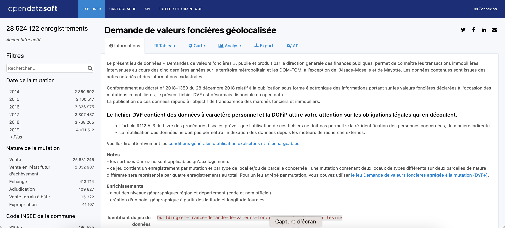

```{r setup, include=FALSE}
knitr::opts_chunk$set(echo = TRUE, message=F, warning=F)
library(knitr)
library(dplyr)
library(ggplot2)
library(sf)
library(mapsf)
```


# DVF 1 :  Acquisition des données

## Introduction

### Objectif
On se propose de collecter l'ensemble des ventes de maison ou d'appartement dans un rayon de 50 km autour d'une ville. On choisit ici Rennes en prenant la place du Parlement de Bretagne comme centre de référence 

### Paramètres
```{r paramètres, echo=T}
# Commune centre 
codectr<-  "35238"  # Code
namectr <- "Rennes"  # Nom
latctr <-  -1.67789
lonctr <-  48.11204
# Choix du rayon de collecte des dvf (en mètres)
rayon <- 50000
# Dossier de stockage
myrep <- "data/Rennes/"
```

## Données dvf

Les données sur les dvf sont disponibles sur le site publicopendatasof:

https://public.opendatasoft.com

On s'intéresse plus particulièrement aux données dvf géolocalisées accessibles ici :

https://public.opendatasoft.com/explore/dataset/buildingref-france-demande-de-valeurs-foncieres-geolocalisee-millesime/


## Données dvf

### Page d'accueil
```{r, out.width="100%"}

```

## Sélection des informations

Le fichier comporte 28 millions d'enregistrement ce qui est évidemment beaucoup ... On va donc procéder à une sélection en se servant des différents onglets disponibles.

A titre d'exemple, nous allons essayer de télécharger les enregistrements vérifiant les conditions suivantes :

- localisation dans un rayon de 60 km autour d'Amiens
- type de transaction : Vente
- type de bien : Maison ou appartement


## Sélection des informations

### Résultats de la sélection
```{r, out.width="100%"}
include_graphics("figures/dvf002.png")
```

Nous constatons qu'il y a 133294 enregistrements vérifiant ces conditions.


## Lien de téléchargement

Nous pouvons récupérer les données soit au format `.csv` pour les analyse statistiques, soit au format `.geojson` pour les analyses spatiales. Mais dans ce cas on ne peut pas dépasser la taille de 50 000 enregistrement. Il vaut donc mieux télécharger au format .csv puisque ce fichier comporte les latitudes et longitudes ce qui nous permettra de créer un fichier cartographique a posteriori

On peut effectuer le téléchargement depuis le site web ou bien juste enregistrer le lien de téléchargement et effectuer l'opération dans R.

Pour trouver le lien on passe la souris au dessus du lien "*télécharger les données au format .csv / seulement les enregistrements sélectionnées*" et on effectue un click droit suivi de "**copier le lien**" 

## Lien de téléchargement

```{r, out.width="100%"}
include_graphics("figures/dvf003.png")
```


## Construction d'une API

On récupère le lien de téléchargement du fichier .csv :

### url du lien
https://public.opendatasoft.com/api/explore/v2.1/catalog/datasets/buildingref-france-demande-de-valeurs-foncieres-geolocalisee-millesime/exports/csv?lang=fr&refine=nature_mutation%3A%22Vente%22&refine=type_local%3A%22Maison%22&refine=type_local%3A%22Appartement%22&facet=facet(name%3D%22nature_mutation%22%2C%20disjunctive%3Dtrue)&facet=facet(name%3D%22type_local%22%2C%20disjunctive%3Dtrue)&where=(distance(%60geo_point%60%2C%20geom%27POINT(2.24771118722856%2049.91161703449722)%27%2C%2060298.74879666418m))&timezone=Europe%2FParis&use_labels=true&delimiter=%3B

## Construction d'une API

A première vue ceci paraît assez obscur mais on réalise assez vite que cette URL reprend l'ensemble des spécifications envoyées pour sélectionner nos enregistrements. On peut souligner en gras les parties utiles :

### url du lien
- &refine=**nature_mutation**%3A%22**Vente**%22&
- &refine=**type_local**%3A%22**Maison**%22
- &refine=**type_local**%3A%22**Appartement**%22
- &where=(**distance**(%60**geo_point**%60%2C%20geom%27
- **POINT**(**2.26968**%20**49.90807**)%27%2C%20**60037m**%20))

## Construction d'une API

Nous allons donc créer un lien qui extrait automatiquement les dvf en modifiant juste la position du point central et le rayon. On prend cette fois-ci  nos paramètres de Rennes

### Nouvelle URL
myurl<-paste0("https://public.opendatasoft.com/api/explore/v2.1/catalog/datasets/buildingref-france-demande-de-valeurs-foncieres-geolocalisee-millesime/exports/csv?lang=fr&refine=nature_mutation%3A%22Vente%22&refine=type_local%3A%22Maison%22&refine=type_local%3A%22Appartement%22&facet=facet(name%3D%22nature_mutation%22%2C%20disjunctive%3Dtrue)&facet=facet(name%3D%22type_local%22%2C%20disjunctive%3Dtrue)&where=(distance(%60geo_point%60%2C%20geom%27POINT(", **latctr**,"%20",**lonctr**,")%27%2C%20",**rayon**,"m))&timezone=Europe%2FParis&use_labels=true&delimiter=%3B")


```{r, echo=FALSE}
myurl<-paste0("https://public.opendatasoft.com/api/explore/v2.1/catalog/datasets/buildingref-france-demande-de-valeurs-foncieres-geolocalisee-millesime/exports/csv?lang=fr&refine=nature_mutation%3A%22Vente%22&refine=type_local%3A%22Maison%22&refine=type_local%3A%22Appartement%22&facet=facet(name%3D%22nature_mutation%22%2C%20disjunctive%3Dtrue)&facet=facet(name%3D%22type_local%22%2C%20disjunctive%3Dtrue)&where=(distance(%60geo_point%60%2C%20geom%27POINT(", latctr,"%20",lonctr,")%27%2C%20",rayon,"m))&timezone=Europe%2FParis&use_labels=true&delimiter=%3B")
```

## Téléchargement

On lance la requête avec l'instruction `download.file()` et on stocke le résultat dans notre répertoire de travail :

### Programme
```{r, eval=FALSE, echo=TRUE}
download.file(url = myurl, 
              destfile = paste0(myrep,"dvf.csv"))
```

### Message
> essai de l'URL 'https://public.opendatasoft.com/...'
downloaded 38.4 MB


L'opération s'execute en un peu moins d'une minute dans cet exemple. Mais il peut arriver qu'elle échoue lorsque le serveur est saturé et dans ce cas il faut recommencer.