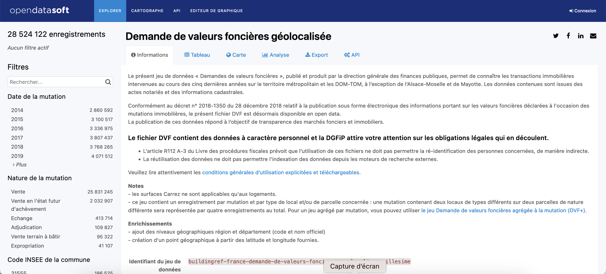
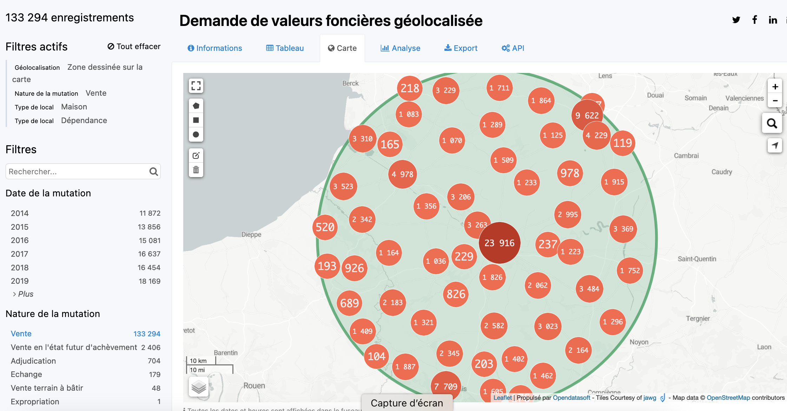
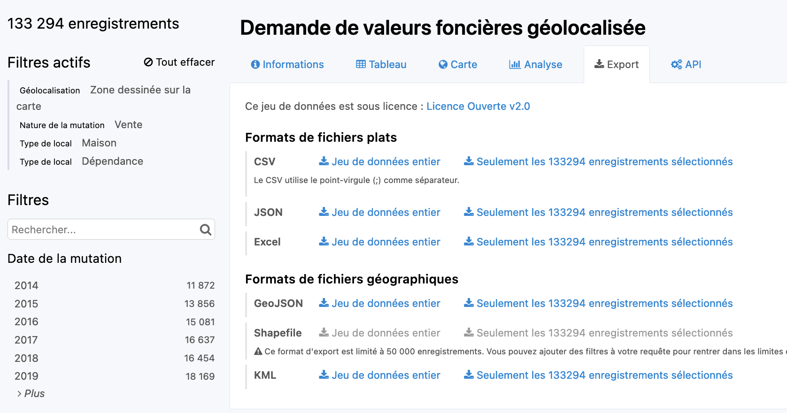

# Préparation des données 

```{r}
library(knitr)
library(dplyr)
library(data.table)
library(readr)
library(sf)
library(ggplot2)
library(mapsf)
```

## Introduction

Ce programme permet de préparer l'ensemble des données statistiques et cartographiques utiles pour l'étude d'une agglomération urbaine. Il charge de très gros fichiers contenus dans un dossier temporaire **tmp** et en extrait les informations utiles pour les placer dans un dossier **data/nomagg** . Il a besoin en entrée du code et du nom de la commune centre ainsi que du chemin vers le dossier de stockage des résultats

```{r paramètres}
# Commune centre 
codectr<-  "45234"  # Code
namectr <- "Orléans"  # Nom

# Dossier de stockage
myrep <- "data/Orléans"

# Choix du fichier ménage et de ses métadonnées
ficmen<-"tmp/FD_LOGEMTZB_2019.csv"
ficmen_meta <-"tmp/Varmod_LOGEMT_2019.csv"

# Choix du rayon de collecte des dvf (en mètres)
rayon <- 40000


```


## Etape 1 : Données administratives

On commence par récupérer les informations adminstratives sur la zone d'étude

### Chargement du fichier administatif

```{r}
adm<-read.table("tmp/maps/table-appartenance-geo-communes-23.csv",
                sep=";", 
                header=T, fileEncoding = "UTF-8",
                quote = '"')
head(adm)
```

### Identification des codes de l'aire urbaine et de l'EPCI

On extrait la ligne correspondant à notre commune centre et on en déduit le code de son epci et de son aire urbaine

```{r}
adm_ctr<-adm %>% filter(adm$CODGEO==codectr)
adm_ctr

my_EPCI <- adm_ctr$EPCI
my_AA <- adm_ctr$AAV2020

```

### Extraction des informations

On extrait toutes les donnes relatives à notre aire urbaine et on les sauvegarde.

```{r}
AA_adm <- adm %>% filter(AAV2020 == my_AA)
saveRDS(AA_adm, paste0(myrep,"/","AA_adm.RDS"))

EPCI_adm <- adm %>% filter(EPCI == my_EPCI)
saveRDS(EPCI_adm, paste0(myrep,"/","EPCI_adm.RDS"))

CTR_adm <- adm %>% filter(CODGEO == codectr)
saveRDS(CTR_adm, paste0(myrep,"/","CTR_adm.RDS"))
```


## Etape 2 : Données géométriques 

On va maintenant extraire les données géométriques relatives au contour des communes et des IRIS

### Communes

On charge le fichier des communes de France et on extrait uniquement celles de la zone d'étude.

```{r}
## Communes de France
mapcom <- st_read("tmp/maps/COMMUNE.shp", quiet=T)

## Aire urbaine
AA_adm<-readRDS(paste0(myrep,"/","AA_adm.RDS"))
AA_mapcom <- mapcom %>% filter(INSEE_COM %in% AA_adm$CODGEO)
saveRDS(AA_mapcom,paste0(myrep,"/","AA_mapcom.RDS"))

## EPCI
EPCI_adm<-readRDS(paste0(myrep,"/","EPCI_adm.RDS"))
EPCI_mapcom <- mapcom %>% filter(INSEE_COM %in% EPCI_adm$CODGEO)
saveRDS(EPCI_mapcom,paste0(myrep,"/","EPCI_mapcom.RDS"))

## Commune centre
CTR_adm<-readRDS(paste0(myrep,"/","CTR_adm.RDS"))
CTR_mapcom <- mapcom %>% filter(INSEE_COM %in% CTR_adm$CODGEO)
saveRDS(CTR_mapcom,paste0(myrep,"/","CTR_mapcom.RDS"))

plot(AA_mapcom$geometry, col="lightyellow", main="zone d'étude")
plot(EPCI_mapcom$geometry,col="orange", add=T)
plot(CTR_mapcom$geometry,col="red", add=T)

```


### IRIS

On ne procède à l'extraction des IRIS que pour l'EPCI et la commune centre

```{r}
## Communes de France
mapiris <- st_read("tmp/maps/CONTOURS-IRIS.shp", quiet=T)


## EPCI
EPCI_adm<-readRDS(paste0(myrep,"/","EPCI_adm.RDS"))
EPCI_mapiris <- mapiris %>% filter(INSEE_COM %in% EPCI_adm$CODGEO)
saveRDS(EPCI_mapiris,paste0(myrep,"/","EPCI_mapiris.RDS"))

## Commune centre
CTR_adm<-readRDS(paste0(myrep,"/","CTR_adm.RDS"))
CTR_mapiris <- mapiris %>% filter(INSEE_COM %in% CTR_adm$CODGEO)
saveRDS(CTR_mapiris,paste0(myrep,"/","CTR_mapiris.RDS"))

plot(EPCI_mapiris$geometry, col="lightyellow", main="EPCI",border="gray50", lwd=0.4)
plot(CTR_mapiris$geometry,col="orange", add=T, border="gray50", lwd=0.4)
plot(EPCI_mapcom$geometry,col=NA, border="black",lwd=1,add=T)

```


## Etape 3 :  logements ordinaires en 2019

Nous partirons des fichiers détail de l'INSEE car, à la différence des tableaux prédéfinis,  ils permettent virtuellement toutes les formes de croisement d'indicateurs. Ils sont évidemment beaucoup plus volumineux, mais ce sera justement l'occasion pour les étudiants en data mining d'être confrontés à des problèmes d'optimisation et de big data. On trouve leur description détaillée sur le site de l'INSEE 

Compte-tenu de la taille des fichiers, nous travaillerons sur une partition de la France en zones


- **Zone A** : Région Île-de-France (région 11) ;
- **Zone B** : Régions Centre-Val de Loire (région 24), Bourgogne-Franche-Comté (région 27), Normandie (région 28) et Hauts-de-France (région 32) ;
- **Zone C** : Régions Grand Est (région 44), Pays de la Loire (région 52) et Bretagne (région 53);
- **Zone D** : Régions Nouvelle-Aquitaine (région 75) et Occitanie (région 76) ;
- **Zone E** : Régions Auvergne-Rhônes-Alpes (région 84), Provence-Alpes-Côte d'Azur (région 93), Corse (région 94), Guadeloupe (région 01), Martinique (région 02), Guyane (région 03) et La Réunion (région 04).


### Lecture du fichier des ménages

Nous commençons par lire le fichiers de la zone qui nous intéresse (au format .csv). Nous utilisons pour cela la fonction *fread* du package **data.table** qui est très rapide mais qui commet une erreur sur le code communal qu'on doit corriger


```{r}

# Lit le fichier
men<-fread(ficmen)


# Ajoute la variable INSEE_COM en format caractère en rétablissant le zéro
code <-as.character(men$COMMUNE)
code[nchar(code)==4]<-paste0("0",code[nchar(code)==4])
men$INSEE_COM<-code


```


### Extraction des ménages de la zone d'étude


```{r}
## Aire urbaine
AA_adm<-readRDS(paste0(myrep,"/","AA_adm.RDS"))
AA_men <- men %>% filter(INSEE_COM %in% AA_adm$CODGEO)
saveRDS(AA_men,paste0(myrep,"/","AA_men.RDS"))

## EPCI
EPCI_adm<-readRDS(paste0(myrep,"/","EPCI_adm.RDS"))
EPCI_men <- men %>% filter(INSEE_COM %in% EPCI_adm$CODGEO)
saveRDS(EPCI_men,paste0(myrep,"/","EPCI_men.RDS"))

## Commune centre
CTR_adm<-readRDS(paste0(myrep,"/","CTR_adm.RDS"))
CTR_men <- men %>% filter(INSEE_COM %in% CTR_adm$CODGEO)
saveRDS(CTR_men,paste0(myrep,"/","CTR_men.RDS"))

```


### Chargement  des méta-données

Il ne faut surtout pas oublier le fichier des métadonnées qui va permettre de recoder facilement tous les facteurs et de décoder les chiffres correspondant aux classes. On va donc le transformer au format R puis l'enregistrer également dans le dossier data. 


```{r}
# Lecture du fichier de métadonnées
meta<-fread(ficmen_meta)
# Enregistrement dans le dossier data
saveRDS(object = meta,
        file = paste0(myrep,"/","men_meta.RDS"))
```


## Données dvf

Les données sur les dvf sont disponibles sur le site publicopendatasof:

https://public.opendatasoft.com

On s'intéresse plus particulièrement aux données dvf géolocalisées accessibles ici :

https://public.opendatasoft.com/explore/dataset/buildingref-france-demande-de-valeurs-foncieres-geolocalisee-millesime/

```{r}

```


### Sélection des informations

Le fichier comporte 28 millions d'enregistrement ce qui est évidemment beaucoup ... On va donc procéder à une sélection en se servant des différents onglets disponibles.

A titre d'exemple, nous allons essayer de télécharger les enregistrements vérifiant les conditions suivantes :

- localisation dans un rayon de 60 km autour d'Amiens
- type de transaction : Vente
- type de bien : Maison ou appartement


```{r}

```

Nous constatons qu'il y a 133294 enregistrements vérifiant ces conditions.


### Paramétrage de l'API

Nous pouvons récupérer les données soit au format `.csv` pour les analyse statistiques, soit au format `.geojson` pour les analyses spatiales. On peut effectuer le téléchargement depuis le site web ou bien juste enregistrer le lien de téléchargement et effectuer l'opération dans R.

Pour trouver le lien on passe la souris au dessus du lien "*télécharger les données au format .csv / seulement les enregistrements sélectionnées*" et on effectue un click droit suivi de "**copier le lien**" 

```{r}

```


On récupère alors une url qui dans notre exemple correspond à ceci :

https://public.opendatasoft.com/api/explore/v2.1/catalog/datasets/buildingref-france-demande-de-valeurs-foncieres-geolocalisee-millesime/exports/csv?lang=fr&refine=nature_mutation%3A%22Vente%22&refine=type_local%3A%22Maison%22&refine=type_local%3A%22D%C3%A9pendance%22&facet=facet(name%3D%22nature_mutation%22%2C%20disjunctive%3Dtrue)&facet=facet(name%3D%22type_local%22%2C%20disjunctive%3Dtrue)&where=(distance(%60geo_point%60%2C%20geom%27POINT(2.24771118722856%2049.91161703449722)%27%2C%2060298.74879666418m))&timezone=Europe%2FParis&use_labels=true&delimiter=%3B


A première vue ceci paraît assez obscur mais on réalise assez vite que cette URL reprend l'ensemble des spécifications envoyées pour sélectionner nos enregistrements. On peut souligner en gras les parties utiles :

https://public.opendatasoft.com/api/explore/v2.1/catalog/datasets/buildingref-france-demande-de-valeurs-foncieres-geolocalisee-millesime/exports/csv?lang=fr&refine=**nature_mutation**%3A%22**Vente**%22&refine=**type_local**%3A%22**Maison**%22&refine=**type_local**%3A%22**Appartement**%22&facet=facet(name%3D%22nature_mutation%22%2C%20disjunctive%3Dtrue)&facet=facet(name%3D%22type_local%22%2C%20disjunctive%3Dtrue)&where=(**distance**(%60**geo_point**%60%2C%20geom%27**POINT**(**2.2696838434785604**%20**49.90807948000782**)%27%2C%20**60037.23340930653m**))&timezone=Europe%2FParis&use_labels=true&delimiter=%3B


### Téléchargement des données

Nous allons créer un lien qui extrait automatiquement les dvf en modifiant juste la position du point central et le rayon. 


```{r}
# Chargement de la commune centre
ctr<-readRDS(paste0(myrep,"/","CTR_mapcom.RDS"))

# calcul du centroïde
ctr<-st_centroid(ctr)

# Conversion en latitude longitude
ctr <-st_transform(ctr,4326)

# Extraction des coordonnées
coo<-st_coordinates(ctr)
coo


# Modification de l'URL
rayon=50000
myurl<-paste0("https://public.opendatasoft.com/api/explore/v2.1/catalog/datasets/buildingref-france-demande-de-valeurs-foncieres-geolocalisee-millesime/exports/csv?lang=fr&refine=nature_mutation%3A%22Vente%22&refine=type_local%3A%22Maison%22&refine=type_local%3A%22D%C3%A9pendance%22&facet=facet(name%3D%22nature_mutation%22%2C%20disjunctive%3Dtrue)&facet=facet(name%3D%22type_local%22%2C%20disjunctive%3Dtrue)&where=(distance(%60geo_point%60%2C%20geom%27POINT(", coo[1],"%20",coo[2],")%27%2C%20",rayon,"m))&timezone=Europe%2FParis&use_labels=true&delimiter=%3B")


# Téléchargement
download.file(url = myurl,destfile = "tmp/dvf.csv")

```


### Sélection de la zone d'étude

On importe le fichier dans R et on extrait les données de l'espace d'étude. On ajoute une colonne INSEE_COM en format caractère

```{r}
dvf<-fread("tmp/dvf.csv")

# Ajoute la variable INSEE_COM en format caractère en rétablissant le zéro
code <-as.character(dvf$`Code INSEE de la commune`)
code[nchar(code)==4]<-paste0("0",code[nchar(code)==4])
dvf$INSEE_COM<-code


## Aire urbaine
AA_adm<-readRDS(paste0(myrep,"/","AA_adm.RDS"))
AA_dvf <- dvf %>% filter(INSEE_COM %in% AA_adm$CODGEO)
saveRDS(AA_dvf,paste0(myrep,"/","AA_dvf.RDS"))

## EPCI
EPCI_adm<-readRDS(paste0(myrep,"/","EPCI_adm.RDS"))
EPCI_dvf <- dvf %>% filter(INSEE_COM %in% EPCI_adm$CODGEO)
saveRDS(EPCI_dvf,paste0(myrep,"/","EPCI_dvf.RDS"))

## Commune centre
CTR_adm<-readRDS(paste0(myrep,"/","CTR_adm.RDS"))
CTR_dvf <- dvf %>% filter(INSEE_COM %in% CTR_adm$CODGEO)
saveRDS(CTR_dvf,paste0(myrep,"/","CTR_dvf.RDS"))


```


## Bilan et nettoyage


Nous avons désormais un dossier qui comporte des informations à l'échelle de l'Aire Urbaine, de l'EPCI et de la commune-Centre

1. Le fonds de carte par communes ou IRIS
2. Le fichier des ménages en 2019 et ses métadonnées
3. Le fichier dvf


```{r}
list.files(myrep)
```

