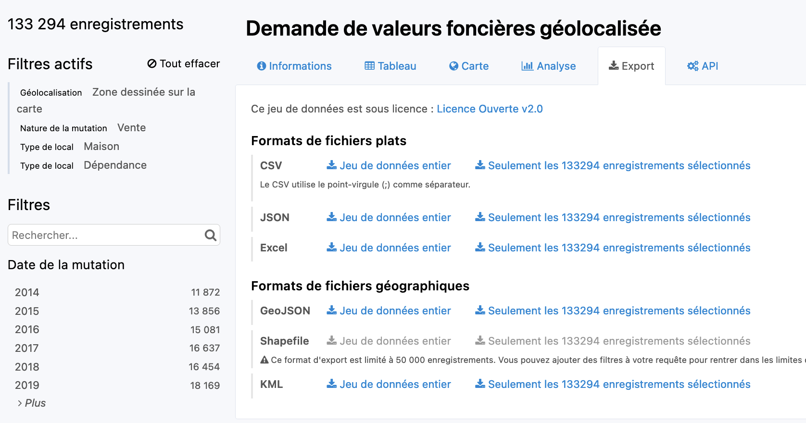

```{r setup, include=FALSE}

library(knitr)
library(xtable)
library(survey)
library(knitr)
library(dplyr)
library(tidyr)
library(data.table)
library(questionr)
library(sf)
library(ggplot2)
library(mapsf)
library(mapview)
library(RColorBrewer)

## Global options
options(max.print="75")
opts_chunk$set(echo=TRUE,
	             cache=FALSE,
               prompt=FALSE,
               tidy=FALSE,
               comment=NA,
               message=FALSE,
               warning=FALSE)

# opts_knit$set(width=75)
```


# Stage Carthageo-Geoprisme 2023 {-}


## Objectifs de la semaine

- Développer les connaissances en analyse quantitative des données dans l'espace
- Exploiter des données individuelles (demandes de valeurs foncières, recensement de la population)
- Approfondir l'utilisation du logiciel R
- Travailler en groupe et préparer une restitution commune
- Répondre à une "commande" dans un temps limité

## Organisation de la semaine

### Planning des intervenants et contenu des journées

- 09/10 (matin, Pierre Pistre) : Organisation de la semaine & présentation des données 
- 09/10 (après-midi, Claude Grasland) : Prise en main des données de recensement (fichier LOGEMT) 
- 10/10 (matin, Pierre Pistre) : Prise en main des données de valeurs foncières (DVF) 
- 10/10 (après-midi, Claude Grasland) : extractions des données pour la commande, et approfondissements statistiques & cartographiques
- 11/10 : Accompagnement des projets de groupe (Hadrien Commenges)
- 12/10 : Accompagnement des projets de groupe (Hadrien Commenges)
- 13/10 : Finalisation des projets de groupe (matin) et restitution orale (après-midi)

### Horaires et planning des salles (Campus des Grands Moulins, Université Paris Cité)
- Horaires indicatifs : 9h30-12h30 et 13h30-17h.
- Salles : du 09/10 au 11/10 : salle de cours 209 (Bâtiment Olympe de Gouges, 2ième étage) ; 12/10 : salle informatique 375 (Bâtiment Olympe de Gouges, 3ième étage) ; 13/10 : salle de cours 209 (Bâtiment Olympe de Gouges, 2ième étage) 

## Données utilisées

### (sources) Base de données principales :
- Fichier "Logements oridinaires" (LOGEMT) 2019 (localisations : IRIS, communes...), produit par l'INSEE à partir du recensement de la population. Données en accés libre : https://www.insee.fr/fr/statistiques/6544344?sommaire=6456104
- "Demandes de valeurs foncières" (version Etalab et extraction avec Opendatasoft), produit par le Ministère de l'Économie, des Finances et de la Souveraineté industrielle et numérique : https://www.data.gouv.fr/fr/datasets/demandes-de-valeurs-foncieres-geolocalisees/

### (sources) Fichiers complémentaires : 
- Table d'appartenance géographique des communes (INSEE) : https://www.insee.fr/fr/information/2028028
- Shapefile ADMIN-EXPRESS-COG® (IGN) des découpage administratifs de la France métropolitaine : https://geoservices.ign.fr/adminexpress#telechargement
- Shapefile Contours IRIS® (IGN) : https://geoservices.ign.fr/contoursiris

## Exercice d'application en groupe

### Périmètres de l'exercice
- Objet d'étude : les dynamiques immobilières dans les principales agglomérations administratives de la "mégarégion parisienne" (hors Paris)
- Population d'étude : les logements vendus récemment et leurs habitants
- Espace(s) d'étude : les principales agglomérations ayant notamment le statut de "métrople" ou de "communauté urbaine" (hors Paris) 
- Echelles et mailles géographiques : département, commune, IRIS

### Consignes de la "commande"
- Contexte général : il est connu que Paris influence la dynamique des territoires bien au-delà de ses territoires les plus proches, à commencer par les principales agglomérations urbaines de la "mégarégion parisienne" (au sens élargi de : https://atlas-paris-mega-region.univ-rouen.fr/). Le secteur immobilier est particulièrement concerné du fait d'une progression sensible des prix des logements dans la plupart de ces territoires au cours à minima de la dernière décennie et d'un potentiel renforcement avec la crise COVID par une progression des installations résidentielles. Pour autant, la géographie des dynamiques immobilières internes à ces agglomérations urbaines reste mal connue de même que les facteurs explicatifs (influence parisienne, spécificités locales et régionales...) et les tendances récentes.
- Commande : après avoir fait le constat de dynamiques immobilières souvent proches, les principales agglomérations urbaines de la "mégarégion parisienne" ont décidé de s'associer pour demander aux différentes antennes régionales de l'Insee la réalisation d'études rigoureuses et fines spatialement sur la situation immobilière de leurs différents territoires de compétence et périphéries proches. Le bilan de ces études sera présenté dans des publications synthétiques, intelligibles par le plus grand nombre et par les acteurs concernés, sous la forme de plusieurs 4 pages - comme produits régulièrement par l'Insee pour publier les résultats de ses études (par exemple, file:///home/pierre/T%C3%A9l%C3%A9chargements/ip1715.pdf ; file:///home/pierre/T%C3%A9l%C3%A9chargements/IR134_Notaires-IPLA_1T-23.pdf).

### Modalités de l'exercice, restitution du travail et organisation durant la semaine
1. Constitution de 6 (voire 7) groupes de 4-5 étudiant.e.s, mélangeant les profils de Master (= Lundi matin)
2. Réflexion sur un angle problématique pour chaque cas d'étude, ainsi que les possibilités d'analyse et d'exploration des données : variables pertinentes, traitements envisagés... (= Lundi à Mercredi)
3. Réalisation des analyses statistiques et cartographiques (= Mardi à Jeudi)
4. Organisation, mise en forme des analyses et rédaction de la note écrite (= Mardi à Vendredi matin)
5. Présentation orale (environ 10 minutes, sans autre support visuel que la note écrite) devant un "jury" composé des intervenants de la semaine (= Vendredi après-midi)  

### Cas d'étude
- Caen (communauté urbaine)
- Le Mans (communauté urbaine)
- Orléans (métropole)
- Reims (communauté urbaine)
- Rouen (métropole) 
- Tours (métropole) 

En option supplémentaire : Amiens (communauté d'agglomération)

### Format du rendu (type 4 pages Insee)
- Introduction et définition (thématique et statistique) de l'objet  : thème et cas d'étude
- Etat des lieux général des prix immobiliers dans le cas d'étude (données : DVF ; échelle : "agglomération" (rayon 40km) ; maille : commune)
- Approfondissements sur les prix immobiliers par type de biens ou de localisation (données : DVF ; échelles : "agglomération" (rayon 40km) et zooms ; mailles : commune, IRIS)
- Profils des acheteurs au sens des nouveaux arrivants (moins de 3 ans) qui sont propriétaires (données : recensement de la population ; échelles : "agglomération" (rayon 40km) et zooms ; mailles : commune, IRIS)


# RP1 : Agrégation sociale

```{r , include=FALSE}
myrep <-"data/Rennes/"
```

## Définir le sujet

Soit le sujet : *Qui sont les nouveaux propriétaires ? Quel est leur niveau de qualification ?*

### Définir le statut d'occupation 
Propriétaire ? Locataire ? Occupant à titre gratuit ?

### Définir la notion de "qualification" ?
Le diplôme le plus élevé ? le nombre d'années d'étude ? 

### Définir la date
Année 2019 uniquement ? Résultats du RP 2019 (2017-2021) ? 

### Définit la population cible
Personnes installées récemment ? depuis quand ?


## Formuler des questions ou des hypothèses

Justes ou fausses, les hypothèses permettent de cadrer l'analyse.

### Diplôme et propriété
Les nouveaux propriétaires sont plus souvent diplômés.

### Âge et propriété
Les propriétaires sont plus âgés que les locataires.

### Propriété et territoire
Les propriétaires sont plus nombreux en zone rurale

###  Logement social, âge et diplômes
Les jeunes ménages sont locataires en ville avant de devnir propriétaires dans les zones périurbaines ou rurales.


## Organiser le travail 

Sutout dans le cadre d'un groupe !

### Ne collecter que les données utiles pour répondre aux questions posées
Afin de ne pas être tenté de partir dans toutes les directions

### Archiver soigneusement les programmes et les résultats
Afin de pouvoir reproduire ultérieurement les analyses sur une autre période, un autre territoire

### Ne pas attendre d'avoir accumulé tous les résultats pour les commenter
Car l'analyse peut suggérer des erreurs ou ouvrir de nouvelles pistes.

### Partir des questions et non pas des outils
Que signifie une réponses (42 ...) sans savoir quelle est la question ? 


## Charger les données statistiques


```{r, cache.comments=TRUE,comment=F,message=F, error=FALSE,echo=T}
tab_ind<-readRDS(paste0(myrep,"AA_men.RDS"))
head(tab_ind[,1:5],2)
```


## Préparation de l'analyse 


- Soit la relation entre statut d'occupation (Y) et diplôme le plus élevé du chef de ménage (X). Il s'agit de deux variables **catégorielles** (= qualitatives) que l'on va typiquement mettre en relation à l'aide d'un **tableau de contingence** et d'un **test du chi-2**. L'analyse statistique est simple sous R mais il faut tenir compte de trois difficultés

- Le choix de la **population de référence** est important. Ici on va sélectionner les ménages installés depuis moins de 3 ans

- la sélection ou le regroupement  des **diplômes** est également important car cela va influer sur les résultats du test.

- la **pondération des individus** doit également être prise en compte puisque le recensement est basé sur un sondage dans les zones urbaines


## Sélection des individus et des variables


```{r, cache.comments=TRUE,comment=F,message=F, error=FALSE,echo=T}
#table(tab_ind$AGEMEN8)
tab_sel<- tab_ind %>% 
  filter(as.numeric(ANEM) < 3) %>%
  select(ANEM, DIPLM,STOCD, IPONDL) 


knitr::kable(head(tab_sel,4))
```

## Recodage des modalités


On cherche le code des modalités dans le fichier des métadonnées

```{r}
meta<-readRDS(paste0(myrep,"men_meta.RDS"))
metasel <- meta %>% 
  filter(COD_VAR %in% c("STOCD"))
kable(metasel[,c(1,3,4)])
```


On recode les modalités des deux variables en regroupant certaines.

```{r, cache.comments=TRUE,comment=F,message=F, error=FALSE,echo=T}
tab_sel$STOCD<-as.factor(tab_sel$STOCD)
levels(tab_sel$STOCD)<-c("Proprétaire","Locataire",
                         "Locataire","Locataire",NA)
tab_sel$DIPLM<-as.factor(tab_sel$DIPLM)
levels(tab_sel$DIPLM) <- c("Aucun","Aucun","Aucun",
                           "BEP","BEP","BEP", "BAC","BAC",
                         "BAC+123","BAC+123","> BAC+3","> BAC+3",NA)

                        
knitr::kable(head(tab_sel,3))
```

## Création du tableau de contingence non pondéré (FAUX)

Le plus simple semble être l'instruction *table()*


```{r, cache.comments=TRUE,comment=F,message=F, error=FALSE,echo=T}
tab_cont<-table(tab_sel$STOCD,tab_sel$DIPLM)

knitr::kable(addmargins(tab_cont))
```


## Création du tableau de contingence pondéré (JUSTE)

On pondère avec *wtd.table()* du package *questionr*.

### programme
```{r, cache.comments=TRUE,comment=F,message=F, error=FALSE,echo=T}
library(questionr)
tab_cont_wtd<-wtd.table(tab_sel$STOCD,tab_sel$DIPLM,
                        weights = tab_sel$IPONDL)

knitr::kable(round(addmargins(tab_cont_wtd),0))
```


## Comparaison des résultats


- Tableau non pondéré ... légèrement faux !

```{r, cache.comments=TRUE,comment=F,message=F, error=FALSE,echo=F}
tab_pct<-cprop(tab_cont)
knitr::kable(tab_pct,digits=1)
```

- Tableau pondéré ... juste !
```{r, cache.comments=TRUE,comment=F,message=F, error=FALSE,echo=F}
tab_pct_wtd<-cprop(tab_cont_wtd)
knitr::kable(tab_pct_wtd,digits=1)
```


## Visualisation du tableau de contingence

On choisit l'orientation du tableau et on l'affiche avec plot()

```{r, cache.comments=TRUE,comment=F,message=F, comment = F,error=FALSE,echo=T,fig.height=3,fig.width=6 }
mytable<-wtd.table(tab_sel$DIPLM,tab_sel$STOCD,weights = tab_sel$IPONDL)
plot(mytable)
```


## Visualisation améliorée du tableau de contingence

Tant qu'à faire, on améliore la figure avec des paramètres supplémentaires : 

```{r, cache.comments=TRUE,comment=F,message=F, comment = F,error=FALSE,echo=T, fig.height=4,fig.width=6}
plot(mytable, 
     main = "Propriété et diplôme dans l'aire urbaine de Rennes", 
     sub = "Source : INSEE - RP 2019 - Ménages installés depuis - de 3 ans",  
     col=c("lightyellow","lightgreen"))
```

## Test du Chi-deux


Ce test se réalise facilement sur le tableau de contingence avec l'instruction *chisq.test()* :

```{r, cache.comments=TRUE,comment=F,message=F, comment = "",error=FALSE,echo=T}
mytest<-chisq.test(mytable)
mytest
```

- **Interprétation** : La relation est très significative (p<0.001)


## Visualisation des résidus

Lorsque la relation est significative, on visualise les cases les plus exceptionnelles avec *mosaicplot( ..., shade = T)*
```{r, cache.comments=TRUE,comment=F,message=F, comment = F,error=FALSE,echo=T, fig.height=4,fig.width=6}
mosaicplot(mytable,  
           main = "Propriété et diplôme dans l'aire urbaine de Rennes", 
           sub = "Source : INSEE - RP 2019 - Ménages installés depuis - de 3 ans",
           shade =T)
```

## Conclusion

### Analyse sociologique
On peut explorer toute une série de variables qui déterminent le fait pour un ménage d'être propriétaire ou locataire.

### Analyse historique
On peut étudier comment les facteurs déterminant l'accès à la propriété varient au cours du temps.

### Analyse spatiale
On peut étudier la part des propriétaires et des locataires en fonction du milieu urbain, périurbain ou rural.

---


# RP2 : Agrégation territoriale


##  Le format sf (spatial features)

La cartographie et plus généralement les opérations géométriques sur des données spatiales dans R peuvent facilement être effectuées avec le **package sf** (spatial features) qui crée des objets uniques  rassemblant à la fois 

- un tableau de données (l'équivalent du fichier .dbf)
- une géométrie (l'équivalent du fichier .shp)
- une projection (l'équivalent du fichier .prj)

Lorsqu'on récupère des fonds de carte au format shapefile (.shp) ou dans d'autres formats standards comme GeoJson, la première tâche consiste donc à les convertir au formt sf afin de pouvoir les utiliser facilement dans R. L'importation se fait à l'aide de l'instruction `st_read` en indiquant juste le nom du fichier .shp à charger. Les autres fichiers (.dbf ou .proj) seront lus également et intégrés dans l'objet qui hérite de la double classe *data.frame* et *sf*.

##  Etapes de préparation des données

Dans notre exemple, nous allons suivre les étapes suivantes :

1. Préparer les données statistiques par IRIS dans un *data.frame*
2. Charger un fonds de carte par IRIS au format *sf*
3. Effectuer une jointure entre les deux fichiers par le code IRIS
4. Sauvegarder le résultat
5. Agréger les données statistiques et géométriques par commune
6. Sauvegarder le résultat.


## Préparer les données statistiques

On importe le fichier des individus et on corrige le code IRIS des communes non divisées en IRIS.


```{r, cache.comments=TRUE,comment=F,message=F, error=FALSE,echo=T}
myrep<-"data/Rennes/"
tab_ind<-readRDS(paste0(myrep,"EPCI_men.RDS"))
tab_ind$IRIS[tab_ind$IRIS=="ZZZZZZZZZ"]<-
  paste0(tab_ind$INSEE_COM[tab_ind$IRIS=="ZZZZZZZZZ"],"0000")

head(tab_ind[,1:5],3)
```

## Selectionner les lignes et colonnes

On décide de ne sélectionner que les ménages de propriétaires installés depuis moins de 3 ans et on retient comme variable le type de logement que l'on recode en deux catégories

```{r, cache.comments=TRUE,comment=F,message=F, error=FALSE,echo=T}
tab_ind2 <- tab_ind %>% filter(as.numeric(ANEM) < 3,        # durée d'occupation < 3 ans
                               STOCD =="10",                # propriétaire de son logement
                               TYPL %in% c(1,2)) %>%        #  Maison ou Appartement  
                        mutate(TYPL = as.factor(TYPL)) %>%
                        select(IPONDL, IRIS, TYPL) 
levels(tab_ind2$TYPL)<-c("Maison","Appt")

knitr::kable(head(tab_ind2,5),digits=2)
```


##  Agréger les données 

On commence par créer un *tableau long* croisant les deux variables et leur effectif pondéré : 

```{r, cache.comments=TRUE,comment=F,message=F, error=FALSE,echo=T}
tab_long<- tab_ind2 %>%
           group_by(IRIS,TYPL)%>%
           summarise(NB=sum(IPONDL))


knitr::kable(head(tab_long,5),digits=2)
```

##  Pivoter le tableau

Puis on fait "pivoter" le tableau pour l'obtenir en format large :

```{r, cache.comments=TRUE,comment=F,message=F, error=FALSE,echo=T}
tab_large <- tab_long %>% pivot_wider(id_cols = IRIS, 
                                      names_from = TYPL,
                                      names_prefix = "T_",
                                      values_from = NB,
                                      values_fill = 0)

knitr::kable(head(tab_large,5),digits=2)
```

## Ajouter de nouvelles variables

On ajoute de nouvelles variables telles que le nombre total de nouveaux propriétaires et la part des propriétaires de maisons parmi eux.


```{r, cache.comments=TRUE,comment=F,message=F, error=FALSE,echo=T}
tab<- tab_large %>% mutate(T_TOT = T_Maison+T_Appt,
                           Maison_pct = 100*T_Maison/T_TOT)

knitr::kable(head(tab,5),digits=c(0,0,0,0,1))
```

## Examiner la distribution statistique 

On examine l'histogramme donnant distribution statistique du % de nouveux propriétaires en maison individuelle.

### programme
```{r, cache.comments=TRUE,comment=F,message=F, error=FALSE,echo=T}
p <- ggplot(tab) + aes (x = Maison_pct) +
                   geom_histogram(breaks = c(0,10,20,30,40,50,
                                             60,70,80,90, 100)) +
                   scale_x_continuous("% de Maisons") +
                   scale_y_continuous("Nombre d'IRIS") +
                   ggtitle(label = "Type de logement des nouveaux propriétaires",
                           subtitle = "Source : INSEE, RP 2019 - Métropole de Rennes")
                            
p
```


## Charger les données géométriques

On importe le fichier des iris de l'agglomération qui est de type sf (spatial features)

```{r,comment=F,message=F, error=FALSE, comments = F, echo=T}
map_iris <- readRDS(paste0(myrep,"EPCI_mapiris.RDS"))
map_iris<-map_iris[,c(5,6,3,2)]
names(map_iris)<-c("IRIS","NOM_IRIS","COM","NOM_COM","geometry")

class(map_iris)
knitr::kable(head(as.data.frame(map_iris)[,1:5],2))
```


## Visualisation du fonds iris avec sf

On peut facilement faire un plot de la colonne *geometry* du fichier sf

```{r,comment=F,message=F, error=FALSE, comments = F, echo=T}
plot(map_iris$geometry,col="lightyellow")
```


## Jointure des données IRIS et du fonds de carte

### programme 
```{r, cache.comments=TRUE,comment=F,message=F, error=FALSE,echo=T,warning=F}
map_iris_tab<-merge(map_iris,tab,
                   by.x="IRIS",by.y="IRIS",
                   all.x=T,all.y=F)

knitr::kable(head(map_iris_tab,3),digits=2)
```

## Cartographie rapide avec sf

Une astuce pour visualiser rapidement une carte choropléthe avec le seul packahe **sf** : 

```{r,comment=F,message=F, error=FALSE, comments = F, echo=T, fig.width=4, fig.height=3.5}
plot(map_iris_tab[,"Maison_pct"])
```


## Sauvegarde du fichier par IRIS

### Au format RDS (pour réutilisation dans R)
```{r,comment=F,message=F, error=FALSE,echo=T,warning=F, eval=F}
saveRDS(map_iris_tab,paste0(myrep,"map_iris_typl.RDS"))
```

### Au format shapefile (pour Magrit ou Qgis)
```{r,comment=F,message=F, error=FALSE,echo=T,warning=F, eval=F}
st_write(map_iris_tab,paste0(myrep,"map_iris_typl.shp"))
```


## Agrégation statistique + géométriques

Grâce aux nouveaux packages de R (*dplyr* et *sf*) il est possible d'**agréger simultanément les statistiques et les géométries** après les avoir stockés dans un même objet de type "sf"

Du coup, on peut gagner beaucoup de temps dans les traitements et les analyses cartographiques, en particulier si l'on veut tester différents niveaux d'agrégation.


## Agrégation des IRIS en communes

L'agrégation est très facile et elle concerne à la fois les variables (de stock) et les geometries


```{r,comment=F,message=F, error=FALSE,echo=T,warning=F}
map_com_tab <- map_iris_tab %>% 
  group_by(COM, NOM_COM) %>% 
  summarise(T_Maison=sum(T_Maison,na.rm=T), 
            T_Appt=sum(T_Appt,na.rm=T)) %>%
  st_cast("MULTIPOLYGON")

map_com_tab <- map_com_tab %>%  mutate(T_TOT = T_Maison+T_Appt,
                                  Maison_pct = 100*T_Maison/T_TOT) 

```


## Agrégation des iris en communes

### résultat statistique
```{r, cache.comments=TRUE,comment=F,message=F, error=FALSE,echo=T}
knitr::kable(head(st_drop_geometry(map_com_tab),3),digits=c(0,0,0,0,0,1))
```


### résultat géométrique
```{r, cache.comments=TRUE,comment=F,message=F, error=FALSE,echo=T}
plot(map_com_tab$geometry,col ="lightyellow")
```

## Examiner la distribution statistique 

On examine l'histogramme donnant distribution statistique du % de nouveaux propriétaires en maison par commune. 


```{r, cache.comments=TRUE,comment=F,message=F, error=FALSE,echo=T}
p <- ggplot(map_com_tab) +aes (x = Maison_pct) +
                   geom_histogram(breaks = c(0,10,20,30,40,50,
                                             60,70,80,90, 100)) +
                   scale_x_continuous("% de Maisons") +
                   scale_y_continuous("Nombre de communes") +
                   ggtitle(label = "Type de logement des nouveaux propriétaires",
                           subtitle = "Source : INSEE, RP 2019, Agglomération de Rennes")
p                            

```


## Cartographie rapide

```{r,comment=F,message=F, error=FALSE, comments = F, echo=T, fig.width=4, fig.height=3.5}
plot(map_com_tab[,"Maison_pct"])
```


---


# RP3 : Cartographie statique

##  Le package map_sf


Le package *mapsf* permet de réaliser des cartes statiques de très haute qualité. Il a en effet été mis au point par des cartographes et des géomaticiens professionnels de l'UMS RIATE. Il prend la suite du package *cartography* dont la maintenance demeurera assuré quelque temps encore mais ne fera plus l'objet de développements futurs. Le package *mapsf* présente l'avantage d'être totalement compatibvle avec le package *sf* ce qui n'était pas autant le cas pour le package *cartography*, plus ancien, et créé pour être compatible avec l'ancien package *sp*. 

On trouvera la documentation du package mapsf à l'adresse suivante : 

https://riatelab.github.io/mapsf/index.html


## Création d'un template cartographique 

Nous allons dans un premier temps apprendre à créer un fonds de carte vierge mais comportant tout l'habillage nécessaire ("template"). Pour cela nous allons charger différentes couches cartographiques correspondant respectivement au département, aux communes et aux iris : 

```{r, cache.comments=TRUE,comment=F,message=F, error=FALSE,echo=T}
myrep<-"data/Rennes/"
map_iris<-readRDS(paste0(myrep,"map_iris_typl.RDS"))
map_com<-readRDS(paste0(myrep,"map_com_typl.RDS"))

```


## tracé d'un fonds de carte vierge

La fonction `mf_map()` avec le paramètre `type = "base"`permet de tracer une carte vide


```{r eval=TRUE,  echo=TRUE}
 mf_map(map_iris, type = "base")
```


## Superposition de couches

On peut toutefois ajouter toute une série de paramètres supplémentaire (`col=`, `border=`, `lwd=`, ...) et superposer plusieurs fonds de carte avec le paramètre `add = TRUE`.  L'ajout de la fonction `layout` permet de rajouter un cadre une légende.

```{r eval=TRUE, echo=TRUE}
# Trace les Iris avec des paramètres
mf_map(map_iris,  
       type = "base", 
       col = "lightyellow", 
       border="gray50",
       lwd=0.3)
# Ajoute les contours des communes
mf_map(map_com,  
       type = "base", 
       col = NA,
       border="red",
       lwd=0.6,
       add = TRUE)

# Ajoute un cadre, un titre et des sources
mf_layout(title = "Communes et IRIS de la zone d'étude", 
          credits = "Sources : IGN et INSEE")
```


## Ajout d'un thème

On peut finalement modifier l'ensemble de la carte en lui ajoutant une instruction `mf_theme()` qui peut reprendre des styles existants ( *"default", "brutal", "ink", "dark", "agolalight", "candy", "darkula", "iceberg", "green", "nevermind", "jsk", "barcelona"*) mais aussi créer ses propres thèmes


```{r eval=TRUE, echo=TRUE}
#Choix du thème
mf_theme("darkula")
# Trace les Iris avec des paramètres
mf_map(map_iris,  
       type = "base", 
       col = "lightyellow", 
       border="gray50",
       lwd=0.3)
# Ajoute les contours des communes
mf_map(map_com,  
       type = "base", 
       col = NA,
       border="red",
       lwd=0.6,
       add = TRUE)
# Ajoute un cadre, un titre et des sources
mf_layout(title = "Communes et IRIS de la zone d'étude", 
          credits = "Sources : IGN et INSEE")
```


## Ajout de texte

On peut ajouter une couche de texte avec la fonction `mf_label()`. Par exemple, on va ajouter à la carte précédente le nom des communes


### programme
```{r eval=TRUE, echo=TRUE}

mf_theme("agolalight")

# Trace les Iris avec des paramètres
mf_map(map_iris,  
       type = "base", 
       col = "lightyellow", 
       border="gray50",
       lwd=0.3)

# Ajoute les contours des communes
mf_map(map_com,  
       type = "base", 
       col = NA,
       border="red",
       lwd=0.6,
       add = TRUE)

# Ajoute une couche de labels
mf_label(map_com, 
         var="COM",
         cex=0.4,
         col="blue",
         overlap = FALSE)

# Ajoute un cadre, un titre et des sources
mf_layout(title = "Communes et IRIS de la zone d'étude", 
          credits = "Sources : IGN et INSEE")


```


## Carte de stock 

Une *carte de stock* représente la localisation de quantités que l'on peut aditionner et dont le total a un sens. Par exemple un nombre d'habitants, un nombre de ménages, un nombre d'automobiles. Ce quantités doivent être représentées par des figures (cercles, carrés, ...) dont la *surface est proportionelle au stock* afin que l'oeil du lecteur puisse les aditionner visuellement. 

Dans le package **mapsf**, on réalise ce type de carte à l'aide de la fonction `mf_map()`en lui donnant le paramètre `type="prop"`.

On va tenter à titre d'exemple de représenter la distribution du nombre de nouveaux propriétaires.


## Carte de stock minimale 

Les instructions minimales sont les suivantes : 

```{r eval=TRUE, echo=TRUE}
# Trace les contours des communes
mf_map(x= map_iris, 
       type = "base")

# Ajoute le nombre de ménages par IRIS
mf_map(x =map_iris, 
      type ="prop",
      var = "T_TOT",
      add=TRUE)
```

Mais le résultat est peu satisfaisant car les cercles sont trop grands. Il faut en pratique toujours effectuer un réglage de ceux-ci avec l'instruction `inches=`


## Carte de stock habillée 


```{r eval=TRUE, echo=TRUE}
mf_theme("agolalight")
mf_map(map_iris, type = "base",  
       col = "lightyellow",border="gray80", lwd=0.3)
mf_map(map_com, type = "base", 
       col = NA,border="black",lwd=1,add = TRUE)

mf_map(map_iris, var = "T_TOT",type = "prop",
  inches = 0.05, col = "red",leg_pos = "left",  
  leg_title = "Nombre de ménages", add=TRUE)

mf_layout(title = "Distribution des nouveaux propriétaires", 
          frame = TRUE,
          credits = "Sources : IGN et INSEE")
```

## Carte choroplèthe 

Une *carte choroplèthe ou d'intensité* représente un phénomène relatif dont la somme n'a pas de sens. Par exemple, il serait absurde d'aditionner les % de logement HLM des IRIS du Val de Marne. Ces variables d'intensité caractèrisent donc l'état général d'une zone (*choros*) et elles vont être représentées par une couleur appliquée à toute la surface de la zone, d'où leur nom de *cartes choroplèthes*. 

La fonction du package **mapsf** adaptée aux variables d'intensité est la fonction `mf_map()`munie du paramètre `type = "choro"`. 

On va prendre l'exemple du % de maisons parmi les nouveaux propriétaires

## Carte choroplèthe minimale

Si on ne précise rien, la carte est réalisée à l'aide de la palette par défaut avec un découpage des classes en quantiles (effectifs égaux).

```{r eval=TRUE, echo=TRUE}
# Carte choroplèthe
mf_map(
  x = map_iris, 
  var = "Maison_pct",
  type = "choro")
```


## Carte choroplèthe habillée

On peut arriver à une carte beaucoup plus satisfaisante en contrôlant l'ensemble des paramètres de couleur et de découpage des classes. Puis en superposant les contours de communes au dessus de la carte des IRIS pour faciliter le repérage. 


```{r eval=TRUE, echo=TRUE}
mybreaks = c(0, 10,20,30,40,50,
             60,70,80,90, 100)
mypal <- mf_get_pal(n = c(5, 5), 
                    pal = c("Greens", "Reds"))
# Carte choroplèthe des iris
mf_map( map_iris, var = "Maison_pct",
        type = "choro",
        breaks = mybreaks,pal = mypal, 
        border=NA,
       col_na = "gray80",leg_title = "% maisons",
       leg_val_rnd = 0)
# Contour des communes et cadre
mf_map(map_com, type = "base", col = NA,
       border="black",lwd=1,add = TRUE)
mf_layout(title = "Les nouveaux propriétaires de maisons", 
          frame = TRUE,
          credits = "Sources : IGN et INSEE")
```


## Carte stock + choroplèthe (1)

On peut combiner les deux modes cartographiques par superposition :

```{r eval=TRUE, echo=TRUE}

mf_theme("agolalight")

# Choisit les classes
mybreaks = c(0,20,40,60,80,100)

# Trace la carte choroplèthe
mf_map(
  x = map_iris, 
  var = "Maison_pct",
  breaks = mybreaks,
 # pal=mypal,
 type = "choro",
  border="white",
  col_na = "gray80",
 lwd=0.3,
 leg_title = "% Maisons", 
 leg_val_rnd = 0,
  
)

# Ajoute les cercles proportionnels

mf_map(
  x =map_iris, 
  var = "T_Maison",
  type = "prop",
  inches = 0.06, 
  col = "red",
  leg_pos = "right",  
  leg_title = "Effectif",
  add=TRUE
)
# Ajoute les contours des communes
mf_map(map_com, 
       type = "base", 
       col = NA,
       border="black",
       lwd=1,
       add = TRUE)

# Ajoute un cadre, un titre et des sources
mf_layout(title = "Les nouveaux propriétaires de maison", 
          frame = TRUE,
          credits = "Sources : IGN et INSEE")


```


## Carte stock + choroplèthe (2)

Mais les cercles dissimuent alors les plages de couleur, aussi on peut utiliser le type `prop_choro` qui place la variable choroplèthe à l'intérieur des cercles

```{r eval=TRUE, echo=TRUE}
mf_theme("agolalight")
mybreaks = c(0, 10,20,30,40,50,60,70,80,90, 100)
mypal <- mf_get_pal(n = c(5, 5), pal = c("Greens","Reds"))
mf_map(map_iris, type = "base",  
       col = "gray80",border="white", lwd=0.3)
mf_map(map_com, type = "base", 
       col = NA,border="white",lwd=1,add = TRUE)
mf_prop_choro( x = map_iris,  var = c("T_TOT", "Maison_pct"), 
  inches = 0.06, col_na = "grey", pal=mypal,
  breaks = mybreaks, nbreaks = 4, lwd = 0.1,
  leg_pos = c("right", "left"),leg_val_rnd = c(0,0),
  leg_title = c("Nouveaux propriétaires", "% Maison"),
  add = TRUE)
mf_layout(title = "Les nouveaux propriétaires de maisons", 
          frame = TRUE, credits = "Sources : IGN et INSEE")
```

---


# DVF1 :  Acquisition des données

## Introduction

### Objectif

On se propose de collecter l'ensemble des ventes de maison ou d'appartement dans un rayon de 50 km autour d'une ville. On choisit ici Rennes en prenant la place du Parlement de Bretagne comme centre de référence 

### Paramètres
```{r paramètres, echo=T}
# Commune centre 
codectr<-  "35238"  # Code
namectr <- "Rennes"  # Nom
latctr <-  -1.67789
lonctr <-  48.11204
# Choix du rayon de collecte des dvf (en mètres)
rayon <- 50000
# Dossier de stockage
myrep <- "data/Rennes/"
```

## Données dvf

Les données sur les dvf sont disponibles sur le site publicopendatasof:

https://public.opendatasoft.com

On s'intéresse plus particulièrement aux données dvf géolocalisées accessibles ici :

https://public.opendatasoft.com/explore/dataset/buildingref-france-demande-de-valeurs-foncieres-geolocalisee-millesime/


```{r, out.width="100%", echo=F}
include_graphics("figures/dvf001.png")
```

## Sélection des informations

Le fichier comporte 28 millions d'enregistrement ce qui est évidemment beaucoup ... On va donc procéder à une sélection en se servant des différents onglets disponibles.

A titre d'exemple, nous allons essayer de télécharger les enregistrements vérifiant les conditions suivantes :

- localisation dans un rayon de 60 km autour d'Amiens
- type de transaction : Vente
- type de bien : Maison ou appartement


```{r, out.width="100%", echo=F}
include_graphics("figures/dvf002.png")
```

Nous constatons qu'il y a 133294 enregistrements vérifiant ces conditions.


## Lien de téléchargement

Nous pouvons récupérer les données soit au format `.csv` pour les analyse statistiques, soit au format `.geojson` pour les analyses spatiales. Mais dans ce cas on ne peut pas dépasser la taille de 50 000 enregistrement. Il vaut donc mieux télécharger au format .csv puisque ce fichier comporte les latitudes et longitudes ce qui nous permettra de créer un fichier cartographique a posteriori

On peut effectuer le téléchargement depuis le site web ou bien juste enregistrer le lien de téléchargement et effectuer l'opération dans R.

Pour trouver le lien on passe la souris au dessus du lien "*télécharger les données au format .csv / seulement les enregistrements sélectionnées*" et on effectue un click droit suivi de "**copier le lien**" 


```{r, out.width="100%", echo=F}

```


## Construction d'une API

On récupère le lien de téléchargement du fichier .csv :


> https://public.opendatasoft.com/api/explore/v2.1/catalog/datasets/buildingref-france-demande-de-valeurs-foncieres-geolocalisee-millesime/exports/csv?lang=fr&refine=nature_mutation%3A%22Vente%22&refine=type_local%3A%22Maison%22&refine=type_local%3A%22Appartement%22&facet=facet(name%3D%22nature_mutation%22%2C%20disjunctive%3Dtrue)&facet=facet(name%3D%22type_local%22%2C%20disjunctive%3Dtrue)&where=(distance(%60geo_point%60%2C%20geom%27POINT(2.24771118722856%2049.91161703449722)%27%2C%2060298.74879666418m))&timezone=Europe%2FParis&use_labels=true&delimiter=%3B


A première vue ceci paraît assez obscur mais on réalise assez vite que cette URL reprend l'ensemble des spécifications envoyées pour sélectionner nos enregistrements. On peut souligner en gras les parties utiles :


- &refine=**nature_mutation**%3A%22**Vente**%22&
- &refine=**type_local**%3A%22**Maison**%22
- &refine=**type_local**%3A%22**Appartement**%22
- &where=(**distance**(%60**geo_point**%60%2C%20geom%27
- **POINT**(**2.26968**%20**49.90807**)%27%2C%20**60037m**%20))


Nous allons donc créer un lien qui extrait automatiquement les dvf en modifiant juste la position du point central et le rayon. On prend cette fois-ci  nos paramètres de Rennes


```{r, echo=TRUE, eval=FALSE}
myurl<-paste0("https://public.opendatasoft.com/api/explore/v2.1/catalog/datasets/buildingref-france-demande-de-valeurs-foncieres-geolocalisee-millesime/exports/csv?lang=fr&refine=nature_mutation%3A%22Vente%22&refine=type_local%3A%22Maison%22&refine=type_local%3A%22Appartement%22&facet=facet(name%3D%22nature_mutation%22%2C%20disjunctive%3Dtrue)&facet=facet(name%3D%22type_local%22%2C%20disjunctive%3Dtrue)&where=(distance(%60geo_point%60%2C%20geom%27POINT(", latctr,"%20",lonctr,")%27%2C%20",rayon,"m))&timezone=Europe%2FParis&use_labels=true&delimiter=%3B")
```

## Téléchargement

On lance la requête avec l'instruction `download.file()` et on stocke le résultat dans notre répertoire de travail :


```{r, eval=FALSE, echo=TRUE}
download.file(url = myurl, 
              destfile = paste0(myrep,"dvf.csv"))
```


> essai de l'URL 'https://public.opendatasoft.com/...'
downloaded 38.4 MB

L'opération s'execute en un peu moins d'une minute dans cet exemple. Mais il peut arriver qu'elle échoue lorsque le serveur est saturé et dans ce cas il faut recommencer.


# DVF2 :  Nettoyage des données

## Introduction

### Objectif
On se propose de nettoyer les donénes relative à l'ensemble des ventes de maison ou d'appartement dans un rayon de 50 km autour d'une ville. On rappelle les paramètres qui ont été utilisés pour acquérir ces données. 

### Paramètres
```{r param dvf, echo=T}
# Commune centre 
codectr<-  "35238"  # Code
namectr <- "Rennes"  # Nom
latctr <-  -1.67789
lonctr <-  48.11204
# Choix du rayon de collecte des dvf (en mètres)
rayon <- 50000
# Dossier de stockage
myrep <- "data/Rennes/"
# Fichier dvf brut
myfic <-"dvf.csv"
```


### Merci à Boris et Florent !

Nous allons effectuer le nettoyage en nous appuyant sur les propositions de Boris Mericskay et Florent Demoraes parues dans  https://journals.openedition.org/cybergeo/39583 

```{r, out.width="80%", echo=F}

```


Les auteurs fournissent en effet un accès à tous les programmes utilisés dans leur article via une archive github :
https://github.com/ESO-Rennes/Analyse-Donnees-DVF


```{r, out.width="60%", echo=F}
include_graphics("figures/boris002.png")

```


## Chargement du jeu de données

On adapte le programme de Boris et Florent en utilisant la fonction `fread()` du package **data.table** car elle est plus rapide/

```{r}
DVF<-fread(paste0(myrep,myfic))
```


## Etape 1 :  Sélection des mutations de type "Ventes" de "Maison" et "Appartement'

### Programme
```{r selection Maisons et Appartements}
etape1 <- DVF %>% filter(`Nature de la mutation` == "Vente")
etape1bis <- etape1 %>% filter(`Type de local` == "Maison" |
                              `Type de local` == "Appartement")
```

### Remarque
Etape inutile si on a déjà fait ce double filtrage à l'aide de l'API

## Etape 2 : Sélection et renommage des variables

```{r selection et renommage variable}
etape2 <- etape1bis %>% 
          select(id = `Identifiant de mutation (Etalab)`,
                 disposition = `Numéro de disposition`  , 
                 parcelle= `Identifiant de la parcelle cadastrale`,
                 date = `Date de la mutation`,
                 nature = `Nature de la mutation`, 
                 INSEE_COM = `Code INSEE de la commune`,
                 INSEE_DEP =  `Code INSEE du département` , 
                 type = `Type de local` ,
                 surface = `Surface réelle du bâti` , 
                 piece = `Nombre de pièces principales`, 
                 prix = `Valeur foncière`  , 
                 latitude = `Latitude`, 
                 longitude = `Longitude`)
```

## Etape 3 : Remplacement des cellules vides par des NA et suppression des NA

```{r suppression des NA}
etape2[etape2==""] <- NA
etape3 <- etape2 %>% na.omit()
```


## Etape 4 : Sélections des mutations simples

### Regrouper les transactions selon l'ID, la surface et la vente

```{r regroupement des transactions}
unique <- etape3 %>% distinct(id, prix, surface)
nbunique <- unique %>% group_by(id) %>% summarise(nb = n())
```

### Suppression des doublons et des mutations multiventes

```{r Suppression des doublons}
etape4 <- nbunique %>% filter(nb==1)
```

## Etape 5 : Jointure attributaire pour récupérer les informations de la mutation

### jointure
```{r jointure}
merge <- merge(etape4,etape3, by="id")
etape5 <- merge %>% distinct(id, .keep_all = TRUE) %>% 
select(id, date, type, nature, INSEE_COM, prix,
      surface, piece, latitude, longitude)
```

### Modification des formats des colonnes
```{r formatage}
etape5$prix <- as.numeric(etape5$prix)
etape5$surface <- as.numeric(etape5$surface)
etape5$piece <- as.numeric(etape5$piece)
```


###  Suppression des valeurs aberrantes

### Fixer un seuil minimal et maximal des prix (percentiles)
```{r seuil minimal}
quantile(etape5$prix, c(0.01, 0.99))
```


### Fixer un seuil minimal et maximal des prix (histogramme)
```{r seuil maximal, fig.height =5}
hist(etape5$prix, breaks = 50000, xlim = c(15000,1000000))
```


### Créer deux jeux de données (maisons / appartements)

```{r creation deux jeux}
table(etape5$type)
Maisons <- etape5 %>% filter(type == 'Maison')
Appartement <- etape5 %>% filter (type == 'Appartement')    
```


### Fixer un seuil maximal des surfaces (histogramme)

```{r seuil max surface, fig.height = 4}
par(mfrow=c(1,2))
hist(Maisons$surface, nclass = 500, xlim = c(0,600))
hist(Appartement$surface, nclass = 500, xlim = c(0,300))
```


## Etape 6 : Sélection des bornes de prix et de surface

```{r selection bornes}
etape6 <- etape5 %>% 
       filter(between(prix, 15000, 5000000)) %>%
       filter(case_when(type=='Appartement' ~  
                          between(surface, 10, 200)) | 
       case_when(type=='Maison' ~ 
                   between(surface, 10, 350)))
```


## Etape 7 : Création de la variable prix/m2

```{r creation variable prix m2}
etape7 <- etape6 %>% mutate(prixm2 = prix/surface)
```

## Etape 8 : Sélection des bornes de prix au m2

### Fixer un seuil minimal des prix au m2 (percentile)

```{r seul min prix m2}
quantile(etape7$prixm2,c(0.01,0.99))
```


### Fixer un seuil maximal des prix au m2 (histogramme)
```{r seuil max prix m2, fig.height=5}
hist(etape7$prixm2, breaks = 1000, xlim = c(0,10000))
```

## Filtrer les valeurs aberrantes

```{r filtre prix m2}
etape8 <- etape7 %>% 
          filter(between(prixm2,330,8000))
```

## Etape 9 : Corrections diverses

### Transformation de la date en année
```{r cars}
etape8$date <- as.character(etape8$date)
etape8 <- etape8 %>% 
            mutate(annee = substr(etape8$date, 1, 4))
```

### Arrondir les variables numériques
```{r arrondir}
etape8$prix <- round(etape8$prix)
etape8$prixm2 <- round(etape8$prixm2)
```


### Rétablir le '0' du code communal et départmental
```{r}
code <-as.character(etape8$INSEE_COM)
code[nchar(code)==4]<-paste0("0",code[nchar(code)==4])
etape8$INSEE_COM<-code
etape8$INSEE_DEP<-substr(etape8$INSEE_COM,1,2)
```


## Etape 10 : Exportation

### Mise en ordre des lignes et colonnes

```{r structuration finale}
DVFOK <- etape8 %>% select(id, date, annee = annee, 
                           INSEE_COM, INSEE_DEP,
                           type, prix, surface, prixm2,
                           latitude, longitude)%>%
                     arrange(date)
```

### Ecrire le jeu de données final en csv
```{r ecriture csv}
write.csv(DVFOK, 
          paste0(myrep, "dvf_clean.csv"),
          quote = FALSE)
```

### Ecrire le jeu de données final en .RDS
```{r ecriture2 RDS}
saveRDS(DVFOK, paste0(myrep, "dvf_clean.RDS"))
```


## Bilan

### Fichier initial
```{r}
dim(DVF)[1]
```

### Fichier nettoyé
```{r}
dim(DVFOK)[1]
```

### % de lignes supprimées
```{r}
100*(dim(DVF)[1]-dim(DVFOK)[1])/dim(DVF)[1]
```

---


# DFVF 3 : Cartographie


## Retour sur sf

Nous revenons sur le **package sf (spatial features)** que nous avons déjà rencontré au moment de la création de cartes thématiques par IRIS ou communes à l'aide du package `mapsf`. 

Ici le package sf va être utilisé pour cartographier non pas des zones mais des localisations ponctuelles. Il pourra être à nouveau couplé avec le logiciel de **cartogaphie statique** comme mapsf , afin par exemple de placer les localisations des ventes foncières au dessus du fonds de carte des IRIS ou communes.

Mais il pourra aussi servir de base à des **cartographies dynamiques** permettant de placer les points correspondant aux ventes sur des réseaux de rue et plus généralement sur des "tuiles" cartographiques permettant d'effectur des zoom. On utilisera à cet effet d'autres packages comme `leaflet` ou sa version simplifiée `mapview`. 


## Zone d'étude

On définit les paramètres de la zone d'étude en ajoutant le lien vers les dvf nettoyées 

```{r param dvf2, echo=T}
# Commune centre 
codectr<-  "35238"  # Code
namectr <- "Rennes"  # Nom
latctr <-  -1.67789
lonctr <-  48.11204
# Choix du rayon de collecte des dvf (en mètres)
rayon <- 50000
# Dossier de stockage
myrep <- "data/Rennes/"
# Fichier dvf nettoyé
mydvf <-"dvf_clean.RDS"
```


## Choix de communes

On choisit plus précisément de travailler sur les communes de l'agglmomération

```{r param3, echo=T}
map_com <- readRDS(paste0(myrep,"EPCI_mapcom.RDS")) %>%
           select(INSEE_COM, NOM, geometry)
plot(map_com$geometry,
     col="lightyellow")
```


## Sélection des dvf nettoyées

Nous reprenons le fichier nettoyé de localisation des ventes de maison et d'appartement établi au chapitre précédent et nous ne conservons que 9 variables ainsi que les ventes situées dans les communes de la zone choisie

```{r}
dvf <- readRDS(paste0(myrep,mydvf)) %>%
        select(annee, INSEE_COM,
               type, prix, surface, prixm2,
               latitude, longitude) %>%
        filter(INSEE_COM %in% map_com$INSEE_COM)


kable(head(dvf,3))
```


## Transformation des dvf en fichier sf

On ajoute une colonne *geometry* en utilisant la fonction `st_as_sf()`du package **sf**. On attribue à la projection le code EPSG = 4326 qui correspond à un fichier latitude longitude. 

```{r}
map_dvf <- st_as_sf(dvf, coords = c("longitude","latitude"))
st_crs(map_dvf)<- 4326

kable(head(map_dvf,3))
```

## Test de superposition

On tente de superposer les deux cartes des ventes et des communes.

### Commune puis dvf
```{r}
plot(map_com$geometry, col="lightyellow")
plot(map_dvf$geometry, col="red", cex=0.2, pch=20,add=T)
```

### dvf puis communes
```{r}
plot(map_dvf$geometry, col="red", cex=0.2, pch=20)
plot(map_com$geometry, col="lightyellow", add=T)

```

- **Commentaire** : les deux fonds de carte existent mais ils ne se superposent pas. Il y a donc un problème de projection !


## Vérification de la projection

Nous savons que les coordonnées du fichier DVF sont en latitude longitude  (EPSG=4326). Mais la projection de notre fonds des communes est en Lambert-93 (EPSG = 2154) 

```{r}
st_crs(map_com)
```
A priori il s'agit bien de la même  de sorte que les coordonnées X,Y devraient bien se superposer sur le fonds IRIS

## Ajustement des deux projections

On transforme donc le fichier des DVF en Lambert-93 pour obtenir une adéquation avec le fichier des communes.

```{r}
map_dvf <- st_transform(map_dvf,2154)
```

Et cette fois-ci on réussit à superposer les deux fonds de carte

```{r}
plot(map_com$geometry, col="lightyellow")
plot(map_dvf$geometry, col="red", cex=0.2, pch=20,add=T)
```


## Cartographie ponctuelle avec mapsf

On peut utiliser les fonctions de mapsf vues précédemment. Par exemple repérer les ventes de maison et d'appartement :

```{r, echo=TRUE, eval=TRUE}
mf_map(map_com, type="base",
       col="lightyellow")
mf_map(map_dvf, type = "typo",
       var= "type",add =T,
       border=NA,
       cex=0.3,
       leg_title = "Bien vendu")
mf_label(map_com,
         var="NOM",cex = 0.4,
         overlap = F,
         col="black",
         halo=T)
mf_layout(title = "Ventes de maisons et d'appartement 2013-2020",
          credits = "Sources : IGN, INSEE, DVF",
          scale = T)


```


## Cartographie ponctuelle avec mapview

Le package **mapview** pemet de créer facilement des cartes interactives ù l'on pourra visualiser les ventes sur un fonds de carte de son choix (OSRM, ESRI, ...). On peut l'utiliser par exemple pour voirune commune précise 

```{r}
library(mapview)
map_dvf_sel<-map_dvf %>% filter(INSEE_COM == "35196")
mapview(map_dvf_sel)
```


On peut améliorer sensiblement la visualisation à l'aide de paramètres présentés sur le site web du package https://r-spatial.github.io/mapview/

```{r, eval=T, echo=T}
library(mapview)
# Choix de la zone d'étude
map_com_sel<-map_com %>% filter(INSEE_COM == "35196")
map_dvf_sel<-map_dvf %>% filter(INSEE_COM == "35196")

# Choix des tuiles
mapviewOptions(basemaps = c("OpenStreetMap" ,
                           "Esri.WorldImagery"))
# Première couche
map1 <- mapview(map_com_sel,
                col.regions="lightyellow",
                alpha.regions = 0.4)

# Deuxième couche
map2<-mapview(map_dvf_sel,
              zcol = "type",
              cex = 4,
              col.regions=c("blue","red"),
             alpha.regions = 0.4)
# Assemblage
map1+map2
```


## Agrégation par communes

On peut évidemment agréger les informations sur les valeurs foncières par communes. Par exemple compter le nombre de maisons vendues et leur prix moyen au m2

```{r, echo=TRUE, eval=TRUE}
dvf_by_com <- dvf %>% 
               group_by(INSEE_COM) %>%
               filter(type == "Maison") %>%
               summarise(nb = n(),
                         med_prixm2 = median(prixm2))

kable(head(dvf_by_com,3))
```


On peut désormais effectuer la jointure entre les données agrégées par adresse et le fichier sf de localisation des adresses :

```{r}
map_com_dvf <- inner_join(map_com,dvf_by_com) %>% st_as_sf()
```


On peut désormais utiliser les méthodes de cartographie déjà vues avec mapsf :


```{r eval=FALSE, echo=TRUE}
mf_theme("agolalight")
mybreaks = c(1000, 1500, 2000, 2500, 3000, 3500,
             4000, 4500, 5000, 5500, 6000)
mypal=brewer.pal(n = 10,name = "Spectral")
mf_map(map_com_dvf, type = "choro", 
       var = "med_prixm2", 
       breaks=mybreaks, pal = mypal,
       border="gray", lwd=0.3,
       leg_title = "prix en €/m2", leg_val_rnd = 0,
       leg_pos = "left")

mf_map( map_com_dvf,  type = "prop",
        var = "nb", inches = 0.12, 
        col="black",border="white",
        leg_title = "nb. de ventes",
        leg_pos = "topleft")

mf_layout(title = "Les ventes de maison de 2013 à 2020",
        frame = TRUE, credits = "Sources : IGN et DVF", 
        arrow = F )
```


## Cartographie par IRIS

Supposons maintenant que l'on souhaite cartographier les prix des maisons par IRIS à l'intérieur de la commune de Rennes. Comment faire dans la mesure où l'IRIS n'est pas mentionné dans le fichier DVF ? Réponse : en superposant les deux fonds de carte et en les intersectant.

### Superposition

```{r, }
map_iris_ctr<-readRDS(paste0(myrep,"CTR_mapiris.RDS")) %>%
               select("NOM_COM","INSEE_COM","CODE_IRIS","NOM_IRIS","geometry")
map_dvf_ctr <- map_dvf %>% filter(INSEE_COM %in% map_iris_ctr$INSEE_COM)
plot(map_iris_ctr$geometry, col="lightyellow")
plot(map_dvf_ctr$geometry,col="red",pch=21,cex=0.1,add=T)
```

### Intersection

On peut faire l'opération avec un SIG ou bien avec le package **sf** en utilisant sa fonction `st_intersect()` qui va ajouter tous les attributs du fichier IRIS au fichier DVF : 

```{r}
inter<-st_intersection(map_dvf_ctr,map_iris_ctr)
kable(head(inter,4))
```

### Agrégation

Il ne reste plus qu'à refaire l'agrégation en suivant la même procédure que pour les communes mais en retirant les iris où il y a eu moins de 5 ventes.

```{r, echo=TRUE, eval=TRUE}
map_iris_dvf <- inter %>% 
               st_drop_geometry() %>%
               group_by(CODE_IRIS, NOM_IRIS) %>%
               filter(type == "Maison") %>%
               summarise(nb = n(),
                         med_prixm2 = median(prixm2)) %>%
              filter(nb >=5) %>% 
              right_join(map_iris_ctr) %>% 
              st_as_sf()
               
             
kable(head(map_iris_dvf,3))
```


### Cartographie

Il ne reste plus qu'à faire la carte en reprenant le programme utilisé pour les communes : 

```{r eval=TRUE, echo=TRUE}
mf_theme("agolalight")
mybreaks = c(1000, 1500, 2000, 2500, 3000, 3500,
             4000, 4500, 5000, 5500, 6000)
mypal=brewer.pal(n = 10,name = "Spectral")
mf_map(map_iris_dvf, type = "choro", 
       var = "med_prixm2", 
       breaks=mybreaks, pal = mypal,
       border="gray", lwd=0.3,
       leg_title = "prix en €/m2", leg_val_rnd = 0,
       leg_pos = "left")

mf_map(map_iris_dvf,  type = "prop",
        var = "nb", inches = 0.08, 
        col="black",border="white",
        leg_title = "nb. de ventes",
        leg_pos = "topleft")

mf_layout(title = "Les ventes de maison de 2013 à 2020",
        frame = TRUE, credits = "Sources : IGN et DVF", 
        arrow = F )
```
